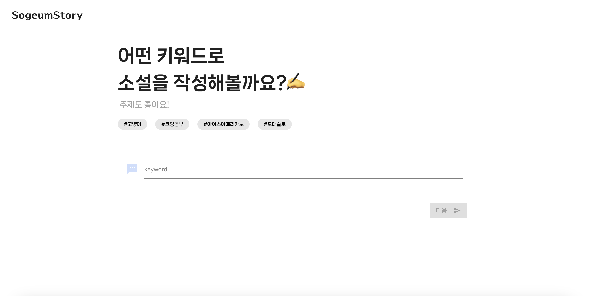
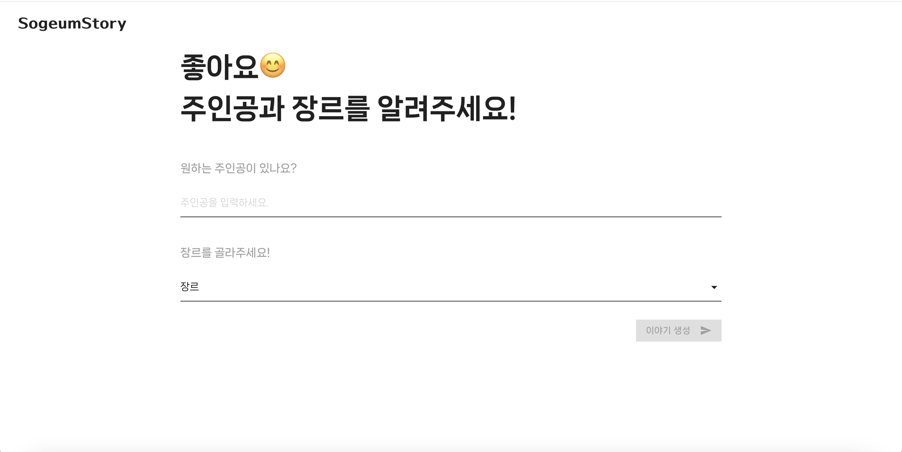
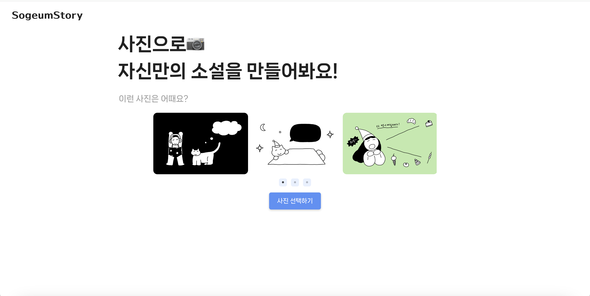
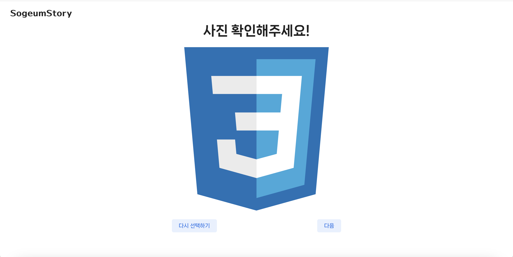
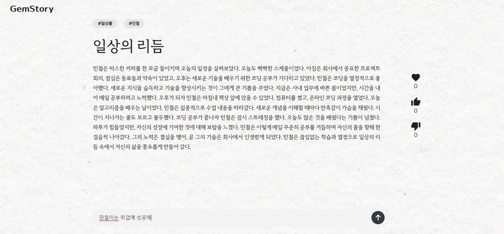

# SogeumStory

## 프로젝트 개요
구글의 Generative AI 서비스인 **Gemini** (당시 Bard/Gemini-Pro)를 사용해  
키워드 또는 이미지를 입력하면 제미나이가 자동으로 이야기를 생성해주는 **스토리 생성 웹**입니다.

## 🧠 제작 배경
AI와 협업해 창의적인 콘텐츠 제작 프로젝트를 만들어 보고 싶었으며,   
이 과정에서 Gemini, **백엔드와 프로트앤드의 데이터 연동 과정**을 익히고자 시작한 
**단기 토이 프로젝트**입니다.  
핵심 기능은 **일주일**간 빠르게 구현했으며, 이후 틈틈히 UI를 다듬거나 구조를 간단하게 리팩토링했습니다.

## 사용한 기술
- Frontend : React,React Router, Materialize CSS
- Backend : Flask, Flask-CORS
- AI 연동 : Google Generative AI (Gemini-Pro, Gemini-1.5 Flash)

## ✨ 주요 화면 미리보기
서비스 흐름에 따라 주요 화면을 정리했습니다.

### 🔹 1. 메인 홈 화면

### 🔹 2. 키워드 기반 이야기 생성
**1. 키워드 입력 → 2. 주인공 & 장르 선택 → 3. 생성된 이야기 결과**
  
  

### 🔹 3. 이미지 기반 이야기 생성
**1. 사진 선택 → 2. 선택된 이미지 확인 → 3. 이미지 기반 스토리 결과**

  
  

### 4 . 🔹 이야기 결과/추가

- 생성된 이야기에 사용자가 추가할 아이디어를 입력하면, Gemini가 이어서 이야기를 작성 가능

## 프로젝트 회고
비록 복잡한 기술을 사용한 건 아니지만, 빠르고 재밌게 제미나이를 경험해본 프로젝트 👍
